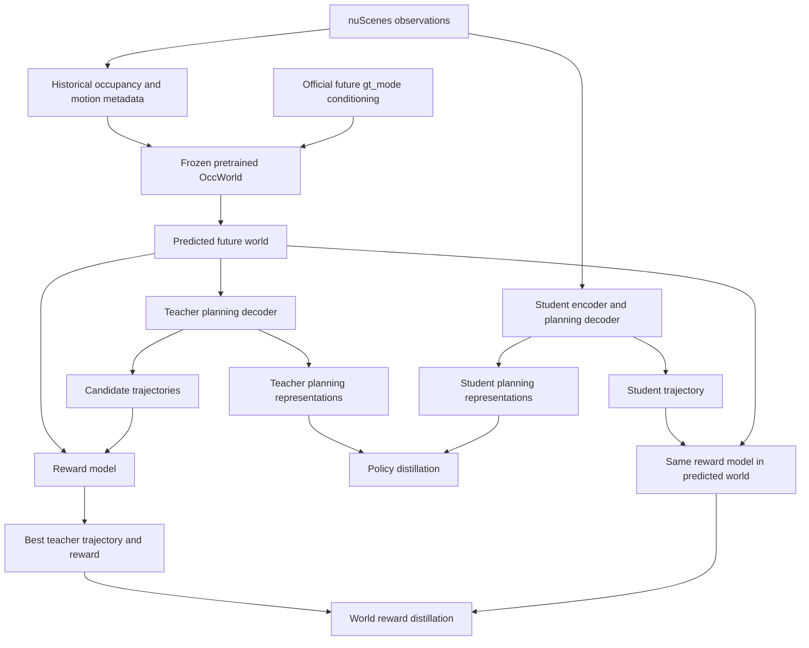

# Paper correspondence

The source is the local WPT.pdf, arXiv:2511.20095v2, March 18, 2026. This project adapts WPT to OccWorld; it does not reproduce Drive-OccWorld or claim the paper's reported performance.

| Component | Paper reference | Implementation | Status and tensor semantics |
| --- | --- | --- | --- |
| Frozen world prediction | Section 3.2, Eqs. 4–7; Section 4.2 | src/world/occworld.py: OccWorldAdapter.predict | Stage 1 adapter to pretrained OccWorld. Input occupancy [1,12,200,200,16]; six predicted grids. This substitutes the world model rather than reimplementing these equations. |
| Stable world outputs | Section 3.2 | src/world/types.py: WorldPrediction | Labels, logits, displacement modes, selected displacements; no ground truth returned as predictions. |
| Temporal observations | Section 3.2, Eq. 4 | src/data/nuscenes.py: load_sample | Official OccWorld traversal and metadata. Training inputs include historical ground truth occupancy and future maneuver conditioning. |
| Teacher planning | Section 3.2, Eq. 8 | Deferred policy module | Predicted future features must enter the teacher decoder. Proposed trajectories [B,K,T,2]; query alignment is unresolved. |
| Reward representation and selection | Section 3.3, Eqs. 9–10, 14 | Deferred reward module | Predicted world and candidate trajectories produce inspectable imitation and simulation rewards. |
| Reward supervision | Section 3.3, Eqs. 11–13 | Deferred reward losses | Eq. 11 has a sign inconsistency; no formula implemented or silently corrected. |
| Policy distillation | Section 3.4, Eq. 15 | Deferred policy distillation loss | L2 norm of aligned student and teacher planning queries, not trajectory regression. |
| World reward distillation | Section 3.4, Eq. 16 | Deferred reward distillation loss | Compare student reward against the best teacher reward in the predicted world. |
| Simulation targets | Appendix Section 6.3, Eqs. 17–23 | Deferred simulation module | Separate NC, DAC, EP, TTC, and comfort targets. |

The adapter executes OccWorld's own autoregressive inference, including its internal discrete codebook decisions. No WPT loss or additional planning head is implemented in Stage 1.

## Corrected flow

At deployment, only observations → student → trajectory remains. The diagram describes the intended later architecture; the teacher, student, reward, and distillation blocks are not yet implemented.
