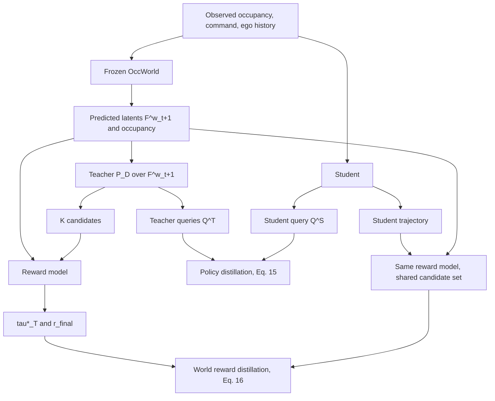

# Paper correspondence

Source: the local WPT.pdf, arXiv:2511.20095v2. This project adapts WPT to OccWorld. It does not reproduce Drive-OccWorld or the camera based policies, and it claims none of the paper's reported numbers. Decisions behind each row are in [implementation_notes.md](implementation_notes.md).

| Component | Paper | Source | Notes and tensor semantics |
| --- | --- | --- | --- |
| World model W | Sec. 3.2, Eqs. 4 to 7 | src/world/occworld.py: OccWorldAdapter.predict | Frozen retrained OccWorld replaces Drive-OccWorld. History [B,5,200,200,16] labels, displacements [B,5,2], commands [B,11,3]. Returns codes [B,6,50,50], occupancy [B,6,200,200,16], ego displacements [B,6,2]. |
| Predicted world features F^w_{t+1} | Eq. 7 | src/world/encoder.py: WorldEncoder | Frozen codebook vectors of the predicted codes, projected to [B,6·625,D] tokens with step and position embeddings. |
| Planning decoder P_D and head P_h | Sec. 3.1, Eqs. 1 and 2 | src/policy/decoder.py: PlanDecoder, PlanHead | Cross-attention refinement of plan queries; MLP to six per-step displacements, accumulated to positions [...,6,2] in the origin LiDAR frame. |
| Student | Eq. 3 | src/policy/student.py: Student | Occupancy encoder over five observed frames (src/policy/encoder.py), one plan query Q^S [B,D]. Imports nothing from src/world or src/reward. |
| Teacher | Eq. 8 | src/policy/teacher.py: Teacher | Decoder memory is F^w_{t+1}, not current features. K mode queries Q^T [B,K,D], each tied to a k-means trajectory anchor as in UniAD [20], give candidates [B,K,6,2] as anchor plus residual. |
| Reward model | Eq. 9, Fig. 3 | src/reward/model.py: RewardModel | Embedding of each trajectory and its offset from OccWorld's predicted ego path cross-attends to world tokens; imitation logits [B,N] and simulation logits [B,N,5]. |
| Selection and final reward | Eqs. 10 and 14 | src/reward/model.py: final_reward; src/training/steps.py: select_best | tau*_T = argmax of Eq. 14 over the candidate set. |
| Imitation target | Eq. 11 | src/reward/targets.py: imitation_target | Sign corrected softmax(-d_i / tau); literal form available. |
| Imitation and simulation losses | Eqs. 12 and 13 | src/losses/reward.py | Soft cross entropy over candidates; BCE on [B,N,5]. |
| Simulation targets | App. 6.3, Eqs. 17 to 23 | src/reward/targets.py: simulation_targets | NC, DAC, EP, TTC, Comf on predicted occupancy masks. |
| Teacher imitation | Baseline-T, Sec. 4 | src/losses/planning.py: wta_loss | Winner-takes-all L1 over K candidates. |
| Policy distillation | Eq. 15 | src/losses/policy_distill.py: policy_loss | Norm of projected Q^S minus the selected teacher query. |
| World reward distillation | Eq. 16 | src/losses/reward_distill.py: reward_loss; src/training/steps.py: wpt_step | Student reward scored jointly with the teacher set in the predicted world; teacher term detached. |
| Total objective | Sec. 3.4 | src/losses/total.py: total_loss | Weighted named terms, each logged separately. |
| Evaluation | Sec. 4.1 | src/evaluation/planning.py | L2 and collision through OccWorld's STP3 PlanningMetric, per-time and cumulative. |

## Flow

```mermaid
flowchart TD
    O[Observed occupancy, command, ego history] --> W[Frozen OccWorld]
    W --> F[Predicted latents F^w_t+1 and occupancy]
    F --> T[Teacher P_D over F^w_t+1]
    T --> Q[Teacher queries Q^T]
    T --> K[K candidates]
    F --> R[Reward model]
    K --> R
    R --> B[tau*_T and r_final]
    O --> S[Student]
    S --> SQ[Student query Q^S]
    S --> ST[Student trajectory]
    Q --> PD[Policy distillation, Eq. 15]
    SQ --> PD
    ST --> R2[Same reward model, shared candidate set]
    F --> R2
    B --> RD[World reward distillation, Eq. 16]
    R2 --> RD
```

At deployment only the student remains: observations to trajectory.
